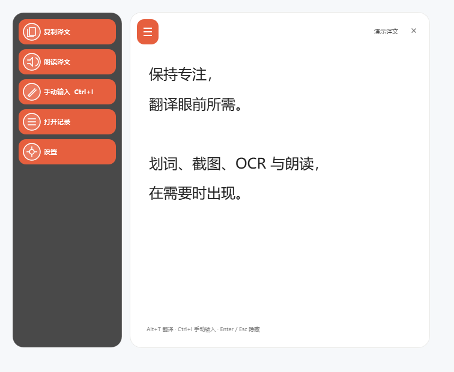
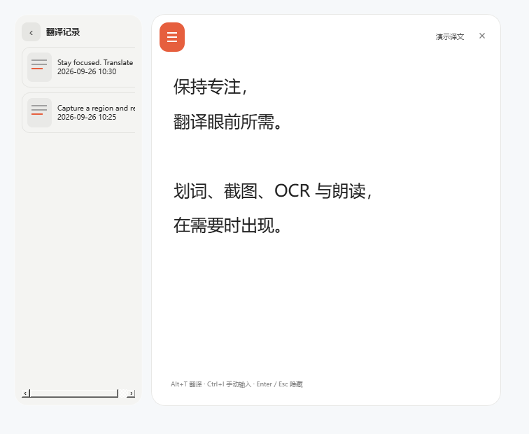
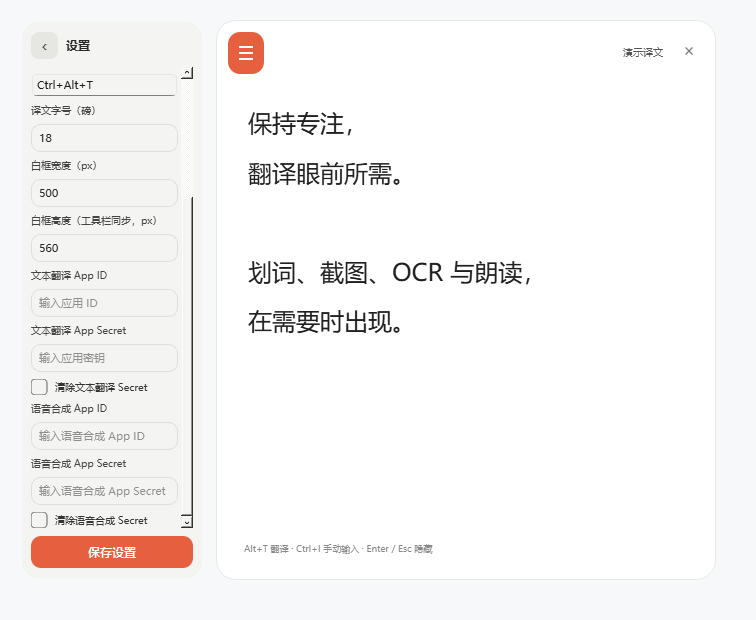

<p align="center"></p>

<h1 align="center">TranEasy</h1>

<p align="center">Translate text and screenshots without leaving what you're doing.<br>Windows 桌面翻译工具：划词、截图、OCR 与朗读，在需要时出现。</p>

<p align="center">


<a href="LICENSE"></a>
</p>



*Current native UI, rendered with public demo text. This is not a recording of a live API request or an end-to-end hotkey test. The current application interface is in Chinese.*

## Download for Windows

**Windows x64 · No Python, PySide6 or AutoHotkey installation required.**

| Edition | Download | Getting started |
| --- | --- | --- |
| Installer — recommended | [TranEasy-Setup-v0.1.0.exe](https://github.com/54ZhangYvGe/translate_tool/releases/download/v0.1.0/TranEasy-Setup-v0.1.0.exe) | Install, then launch from the Start menu; a desktop shortcut is optional |
| Portable | [TranEasy-v0.1.0-win64-portable.zip](https://github.com/54ZhangYvGe/translate_tool/releases/download/v0.1.0/TranEasy-v0.1.0-win64-portable.zip) | Extract the entire archive and run `TranEasy.exe` |

> Keep the bundled folders alongside the executables.

## Features

- **Selection translation** — Select text and press `Alt+T` to view the translation.
- **Screenshot translation** — Press `Ctrl+Alt+T`, select a region, and translate its locally recognized text. Blank regions are dismissed quietly.
- **Manual input** — Translate text from the collapsible sidebar without switching to a website.
- **Text to speech** — Read translations aloud using an independent Youdao TTS service. Automatic playback is optional; each request is limited to 50 words.
- **Local history** — Browse recent translations and revisit their original text.
- **Customizable controls** — Configure the screenshot hotkey, screenshot toggle, translation font size and result-card dimensions.
- **Protected credentials** — Translation and TTS secrets are stored independently using Windows current-user DPAPI.

## Screenshots

### Translation history



### Independent API settings



## Quick Start

1. Install or extract TranEasy, then launch it. It stays in the system tray.
2. Open the result window's hamburger sidebar → **Settings (设置)**. Enter your own Youdao credentials and save.
3. Select text and press **Alt+T**, or press **Ctrl+Alt+T** and select a screen region. Press **Esc** to cancel capture.
4. For manual translation, open **Manual input (手动输入)** in the sidebar. **Ctrl+I** also works inside the result window.
5. Copy the result, read it aloud or browse history from the sidebar. Closing the result window hides it; use the tray's Exit command to stop the application.

The screenshot and in-window manual-input shortcuts can be changed in Settings. The selection shortcut defaults to `Alt+T` and can be changed through the ordinary configuration's `hotkey` field. Shortcut conflicts or applications with different privilege levels may require adjustments.

## API Setup

Online translation and speech synthesis use **Youdao AI** and require your own credentials. TranEasy does not include the author's API keys.

Create an application and enable the corresponding service at [Youdao AI](https://ai.youdao.com/). Find its App ID and App Secret in the application overview. See the official [getting-started documentation](https://ai.youdao.com/doc.s) and [text translation API reference](https://ai.youdao.com/DOCSIRMA/html/transapi/trans/api/wbfy/index.html). Availability, quotas and pricing are determined by Youdao.

| Service | Separate credentials |
| --- | --- |
| Text translation | App ID / App Secret |
| Text to speech | App ID / App Secret |

The two IDs and secrets are independent. Secret inputs are masked by default. Enter a new value to replace a secret, leave it blank to keep the existing value, or select the corresponding clear option and save to delete it. Clearing one service does not affect the other. TTS credentials are unnecessary if you only need translation.

**No manual `.env` editing is required.** Legacy credentials are migrated once: the secure write is verified before the corresponding legacy fields are removed. Failed migrations preserve the old data; plaintext files are not used as the official secret store.

## Privacy & Security

- App Secrets are protected with Windows current-user DPAPI, kept out of ordinary `config.json`, and never bundled with the application.
- Screenshots are processed locally in memory. OCR runs locally; online translation sends recognized text, not the screenshot.
- Speech synthesis sends the text to Youdao TTS. Generated audio is played through a local temporary file.
- Translation history is stored locally as **plaintext TXT**, not encrypted. Manage sensitive content and backups accordingly.
- TranEasy has no account system or application telemetry upload. Online providers handle requests under their own policies.
- DPAPI files are not portable credential backups. Moving to another Windows user or environment may require re-entering credentials.

## Installer vs. Portable

| | Installer | Portable |
| --- | --- | --- |
| Application files | Current user's `%LOCALAPPDATA%\Programs\TranEasy` | Extracted folder |
| Configuration and history | Under `%LOCALAPPDATA%\TranEasy` | Under the extracted folder |
| Secrets | Independent DPAPI files under `%LOCALAPPDATA%\ScreenTrans` for both editions | Same |
| Launch | Start menu; optional desktop shortcut | `TranEasy.exe` |
| Removal | Windows uninstall; configuration and history are retained | Exit, back up history, then remove the folder |

The `ScreenTrans` credential-directory name is retained for compatibility. The installer does not enable startup automatically. The main application does not require administrator privileges. The portable folder must be writable.

## Known Limitations

- Windows x64 only. Windows 10 / 11 are the targets; local execution has been tested on Windows 11.
- First-time OCR model initialization may be slow. No fixed response-time guarantee is made.
- Binaries are not code-signed; Windows SmartScreen may show an unknown-publisher warning.
- Online translation and TTS depend on your credentials, network and service quota.
- The current application interface is in Chinese.
- Live API calls and clean-Windows compatibility have not been fully verified. Physical hotkeys have been manually verified by the author; automated key injection was inconclusive.

## Development

This section is for developers. End users can use the downloads above.

Use standard CPython 3.12 x64 and AutoHotkey v2. Building the AHK launcher also requires Ahk2Exe.

```powershell
git clone https://github.com/54ZhangYvGe/translate_tool.git
cd translate_tool
py -3.12 -m venv .venv
.\.venv\Scripts\python.exe -m pip install -r requirements.lock.txt
.\.venv\Scripts\python.exe -m pip check
.\.venv\Scripts\python.exe -m unittest discover -s tests -v
Copy-Item config.example.json config.json
```

For source execution, run `translator.ahk`. Set `provider` to `mock` in the configuration for development tests without real credentials.

```powershell
.\build_release.ps1
.\build_installer.ps1 -Compiler '<path to Inno Setup ISCC.exe>'
```

Override the default AHK compiler locations with `-AhkCompiler` / `-AhkBase` if needed. PyInstaller produces `dist/ScreenTrans`; the installer and portable ZIP go into `release/`. Build outputs are excluded from source control.

| File | Purpose |
| --- | --- |
| `resident_app.py` | Resident PySide6 GUI and task coordination |
| `translate.py` | Translation, speech, configuration and history |
| `screen_ocr.py` | Local OCR |
| `secret_store.py` | Windows DPAPI storage and migration |
| `translator.ahk` | Global hotkeys and resident-process launcher |
| `tests/` | Automated tests |
| `ScreenTrans.spec` / `installer/TranEasy.iss` | Packaging and installer configuration |

`run_packaged_checks.ps1` / `run_installer_checks.ps1` use isolated directories, Mock responses and synthetic credentials. They do not replace live API or clean-Windows acceptance tests.

### Stack

Python · PySide6 · AutoHotkey v2 · RapidOCR / ONNX Runtime CPU · Windows DPAPI · PyInstaller · Inno Setup.

## FAQ

**No window after launch?** TranEasy stays in the tray. Select text and use `Alt+T`. If it does not respond, check the tray, hotkey conflicts and the target application's privileges.

**No text in a screenshot?** Blank selections are dismissed quietly. Capture clear text and allow time for the initial OCR warm-up.

**Translation or speech failed?** Check the corresponding service's separate credentials, enabled service, network and quota. You can retry without restarting the whole application.

**Credentials stopped working after moving computers?** DPAPI is bound to the Windows user environment. Re-enter secrets rather than copying ciphertext as a universal backup.

**Does uninstall erase history?** The installer retains user data. Portable history is in the extracted folder, so back it up before removing that folder.

## License

TranEasy source code is licensed under the [MIT License](LICENSE). Third-party dependencies and bundled components retain their own licenses. MIT does not replace Youdao's service terms or third-party build-tool licensing conditions.
